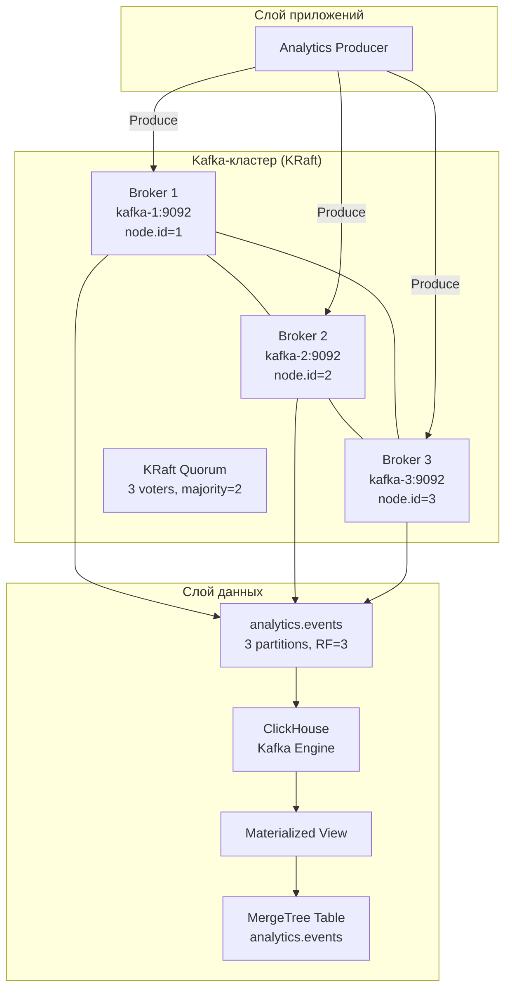

# Kafka-кластер на Ansible

## Обзор

Готовый к продакшену деплой Kafka-кластера с использованием Ansible, Docker и KRaft.
Предназначен для сбора аналитических событий с end-to-end пайплайном в ClickHouse.

**Ключевые решения:**
- Режим KRaft (без ZooKeeper)
- Docker-контейнеры (не Docker Swarm)
- 3 комбинированных ноды broker/controller
- RF=3, min.insync.replicas=2
- Персистентное хранилище с защитными механизмами

## Архитектура



## Требования

- Ansible >= 2.14
- Python >= 3.10
- Ubuntu 24.04 LTS (целевые хосты)
- Docker CE (устанавливается через Ansible)
- 3 VM с минимум 2 CPU, 4GB RAM, 50GB диск на каждую

## Инфраструктура

Целевая инфраструктура: 3 VM в Yandex Cloud (или любом другом провайдере)

| Хост     | Роль                   | Node ID | Порты          |
|----------|------------------------|---------|----------------|
| kafka-1  | Broker + Controller    | 1       | 9092, 9093     |
| kafka-2  | Broker + Controller    | 2       | 9092, 9093     |
| kafka-3  | Broker + Controller    | 3       | 9092, 9093     |
| clickhouse-1 | ClickHouse         | -       | 8123, 9000     |

### Публичные и внутренние IP

Каждая VM в Yandex Cloud имеет **два IP**:
- **Внутренний IP** (например `10.128.0.x`) — для трафика между VM в одной VPC. Kafka общается по внутренней сети: `advertised.listeners`, `controller.quorum.voters`, ClickHouse → Kafka.
- **Публичный IP** (например `158.160.x.x`) — только для SSH с вашей рабочей машины.

IP-адреса НЕ захардкожены. Настройка через переменные окружения:

```bash
# Публичные IP (для SSH)
export KAFKA_1_PUBLIC_IP=158.160.1.10
export KAFKA_2_PUBLIC_IP=158.160.1.11
export KAFKA_3_PUBLIC_IP=158.160.1.12
export CLICKHOUSE_PUBLIC_IP=158.160.1.13

# Внутренние IP (для Kafka-трафика)
export KAFKA_1_IP=10.128.0.5
export KAFKA_2_IP=10.128.0.6
export KAFKA_3_IP=10.128.0.7
export CLICKHOUSE_IP=10.128.0.8

# SSH-ключ
export ANSIBLE_SSH_PRIVATE_KEY=~/.ssh/id_ed25519
```

Или прямое редактирование `inventories/yandex/hosts.yml`:

## Почему KRaft

**Выбрано:** KRaft (Kafka Raft metadata mode)

**Рассмотренные альтернативы:**
- ZooKeeper: устаревший, отдельный кластер, больше операционных затрат, выводится из эксплуатации

**Почему KRaft:**
- Не нужно управлять отдельным кластером ZooKeeper
- Проще архитектура (меньше подвижных частей)
- Быстрее операции с партициями
- Нативный механизм консенсуса Kafka
- Режим ZooKeeper выведен из эксплуатации в Kafka 3.x+

**Риски:**
- KRaft новее (но стабилен с Kafka 3.3+)
- Миграция с ZooKeeper на KRaft возможна, но нетривиальна

## Почему 3 брокера

**Выбрано:** 3 брокера

**Рассмотренные альтернативы:**
- 1 брокер: нет HA, единая точка отказа
- 2 брокера: невозможно сформировать кворум KRaft с RF=3 (нужно нечётное число для большинства)
- 5 брокеров: выше HA, но избыточно для данного случая

**Почему 3:**
- Минимум для RF=3 с мажоритарным кворумом (2/3)
- Переживает отказ 1 брокера
- Экономически эффективно для тестового/демо окружения

## Почему RF=3

**Replication Factor = 3**

Каждая партиция реплицируется на все 3 брокера.

**Почему:**
- Переживает отказ 1 брокера без потери данных
- С min.insync.replicas=2 запись требует подтверждения от 2 реплик
- Обеспечивает масштабируемость чтения (потребители могут читать с любой реплики)

**Компромисс:**
- 3x потребление хранилища
- Выше нагрузка на сеть
- Но для аналитических событий надёжность > оптимизация затрат

## Почему min.insync.replicas=2

**Минимальное количество синхронизированных реплик = 2**

**Поведение:**
- Продюсер с `acks=all` требует подтверждения от 2 реплик
- Если менее 2 реплик синхронизированы, запись ОТКЛОНЯЕТСЯ (не теряется)
- Это предотвращает потерю данных ценой доступности

**Сценарии:**
- Все 3 брокера работают: запись успешна, полная надёжность
- 1 брокер упал: запись успешна (осталось 2 ISR), потери данных нет
- 2 брокера упали: запись ЗАБЛОКИРОВАНА (остался 1 ISR), предотвращает потерю данных
- Это ЗАЛОЖЕНО ПРОЕКТОМ — лучше заблокировать запись, чем потерять данные

## Docker против Docker Swarm

**Выбрано:** Docker-контейнеры под управлением Ansible (НЕ Docker Swarm)

**Анализ Docker Swarm для Kafka:**

Docker Swarm обеспечивает:
- Оркестрацию контейнеров
- Обнаружение сервисов
- Rolling updates
- Балансировку нагрузки

**Почему Swarm НЕ нужен для Kafka:**

Kafka уже обеспечивает:
- **Репликацию** — данные реплицируются между брокерами
- **Партиционирование** — данные распределены между брокерами
- **Выборы лидера** — лидеры партиций выбираются автоматически
- **Failover брокеров** — продюсеры/потребители переподключаются к доступным брокерам
- **Кворум KRaft** — консенсус по метаданным без внешней координации

Добавление Swarm привело бы к:
- Излишней сложности
- Двойной оркестрации (Swarm + Kafka)
- Усложнению персистентного хранилища (Swarm volumes vs данные Kafka)
- Дополнительному домену отказа (отказ менеджера Swarm)
- НЕ улучшило бы собственные механизмы HA Kafka

**Почему Docker (без Swarm) ПОЛЕЗЕН:**
- Консистентная упаковка и деплой
- Проще управление версиями
- Упрощённый откат
- Соответствует стеку компании (Docker используется)
- Ansible может управлять контейнерами идемпотентно через `community.docker.docker_container`

**Рассмотренная альтернатива: systemd + нативный Kafka**
- Работало бы, но Docker даёт лучшую изоляцию и портируемость
- Компания уже активно использует Docker
- Docker упрощает обновления и откаты

## Хранилище

**Персистентное хранилище КРИТИЧНО для Kafka.**

Директории данных:
- `/var/lib/kafka/data` — данные Kafka (топики, партиции, сообщения)
- `/var/lib/kafka/data/__cluster_metadata-0/` — метаданные KRaft
- `/var/log/kafka` — логи Kafka

**Защитные механизмы:**
1. `meta.properties` содержит `cluster.id` и `node.id`
2. Перед любой инициализацией существующие значения ЧИТАЮТСЯ и ПРОВЕРЯЮТСЯ
3. Если существующий `node.id` отличается от настроенного → **ПРЕРВАТЬ** (предотвращает потерю данных)
4. Если существующий `cluster.id` отличается от настроенного → **ПРЕРВАТЬ** (предотвращает потерю данных)
5. Форматирование KRaft выполняется ТОЛЬКО если `meta.properties` не существует
6. `kafka_force_reinitialize: false` по умолчанию — деструктивные операции требуют явного включения

**Рекомендации для продакшена:**
- Использовать выделенные NVMe-диски для `/var/lib/kafka/data`
- Отдельный диск для логов
- RAID10 для данных, RAID1 для логов
- Регулярное резервное копирование `meta.properties`

## Сеть

**Распределение портов:**
| Порт | Назначение           | Доступ                       |
|------|----------------------|------------------------------|
| 9092 | Клиентский трафик    | Только доверенные сети       |
| 9093 | Трафик контроллера   | Только ноды Kafka            |
| 9999 | JMX-метрики          | Сеть мониторинга             |

**Разделение listener-ов:**
- `CLIENT` — для трафика продюсеров/потребителей
- `CONTROLLER` — для межузловой коммуникации KRaft

**Фаервол (UFW):**
- Политика по умолчанию: DENY входящий
- SSH (22): разрешён
- Клиентский порт (9092): разрешён из доверенных сетей (10.0.0.0/8 и т.д.)
- Порт контроллера (9093): разрешён только между нодами Kafka
- Порт JMX (9999): разрешён из сети мониторинга

**Kafka НЕ открыта в публичный интернет.**

## Безопасность

**Текущая реализация:**
- Протокол PLAINTEXT (подходит для внутренней сети)
- Фаервол ограничивает доступ доверенными сетями
- Без аутентификации (предполагается доверенная сеть)

**Требования для продакшена (не реализовано из-за ограничений по времени):**

### Шифрование TLS
```properties
listener.name.client.ssl.keystore.location=/etc/kafka/ssl/keystore.jks
listener.name.client.ssl.truststore.location=/etc/kafka/ssl/truststore.jks
listener.name.client.ssl.client.auth=required
```

### Аутентификация SASL
```properties
listener.name.client.sasl.enabled.mechanisms=SCRAM-SHA-512
```

### ACL
```properties
authorizer.class.name=kafka.security.authorizer.AclAuthorizer
```

## Секреты / Infisical

**Текущая реализация:**
- Секреты не требуются (режим PLAINTEXT)
- `kafka_cluster_id` генерируется один раз и сохраняется персистентно

**Интеграция с Infisical (рекомендуется для продакшена):**

Компания использует Infisical для управления секретами. Подход к интеграции:

1. **Хранить в Infisical:**
   - `KAFKA_CLUSTER_ID` — идентификатор кластера
   - `KAFKA_SSL_KEYSTORE_PASSWORD` — пароль keystore TLS
   - `KAFKA_SSL_TRUSTSTORE_PASSWORD` — пароль truststore TLS
   - `KAFKA_SASL_PASSWORD` — пароль аутентификации SASL

2. **Получать в Ansible:**
   ```yaml
   - name: Get secrets from Infisical
     ansible.builtin.uri:
       url: "https://app.infisical.com/api/v3/secrets"
       headers:
         Authorization: "Bearer {{ infisical_token }}"
     register: infisical_secrets
     no_log: true
   ```

3. **Слой абстракции:**
   Создать `roles/secrets/tasks/main.yml` с возможностью переключения между:
   - Infisical (продакшен)
   - Ansible Vault (fallback/разработка)
   - Переменные окружения (CI/CD)

**Fallback: Ansible Vault**
```bash
ansible-vault encrypt inventories/yandex/group_vars/kafka.yml
ansible-playbook --ask-vault-pass ...
```

## Деплой

### Подготовка

```bash
# Установка Ansible и зависимостей
pip install ansible-core
ansible-galaxy collection install -r ansible/requirements.yml

# Настройка inventory через .env (рекомендуется)
cp .env.example .env
vim .env  # заполни реальные IP
```

### Автоматический деплой через deploy.sh

В корне проекта есть оркестратор `deploy.sh`, который автоматизирует весь процесс:

```bash
# Полный деплой (проверки + деплой + health check)
./deploy.sh

# Только проверки (Ansible, SSH-ключ, .env, IP, SSH-доступ) — без деплоя
./deploy.sh --check

# Деплой только Kafka (без ClickHouse)
./deploy.sh --kafka-only

# Деплой + тест идемпотентности
./deploy.sh --test-idempotency

# Деплой + end-to-end тест Kafka → ClickHouse
./deploy.sh --test-e2e

# Деплой + тест отказов
./deploy.sh --test-failure
```

Что делает `deploy.sh`:
1. Проверяет Ansible, SSH-ключ, `.env`
2. Валидирует IP-адреса
3. Проверяет SSH-доступ до всех VM
4. Устанавливает Ansible-коллекции
5. Запускает `ansible-playbook`
6. Выполняет health check
7. Опционально запускает тесты

### Ручной деплой

```bash
cd ansible

# Полный деплой
ansible-playbook -i inventories/yandex/hosts.yml playbooks/site.yml

# Деплой только Kafka
ansible-playbook -i inventories/yandex/hosts.yml playbooks/site.yml --tags kafka

# Деплой только ClickHouse
ansible-playbook -i inventories/yandex/hosts.yml playbooks/site.yml --tags clickhouse
```

### Проверка деплоя

```bash
# Health check
bash scripts/health_check.sh <kafka-host> 9092 kafka-broker

# Проверка топиков
ssh ubuntu@kafka-1 "docker exec kafka-broker /opt/kafka/bin/kafka-topics.sh \
  --bootstrap-server localhost:9092 --list"

# Проверка метаданных кластера
ssh ubuntu@kafka-1 "docker exec kafka-broker /opt/kafka/bin/kafka-metadata.sh \
  --snapshot /var/lib/kafka/data/__cluster_metadata-0/00000000000000000000.log \
  --cluster-id $(ssh ubuntu@kafka-1 'grep cluster.id /var/lib/kafka/data/meta.properties | cut -d= -f2')"
```

## Верификация

### Быстрая проверка

```bash
# 1. Проверить, что все брокеры запущены
for host in kafka-1 kafka-2 kafka-3; do
  ssh ubuntu@$host "docker ps --filter name=kafka-broker --format '{{.Status}}'"
done

# 2. Проверить существование топика
ssh ubuntu@kafka-1 "docker exec kafka-broker /opt/kafka/bin/kafka-topics.sh \
  --bootstrap-server localhost:9092 --describe --topic analytics.events"

# 3. Отправить тестовое сообщение
echo '{"test":"message"}' | ssh ubuntu@kafka-1 \
  "docker exec -i kafka-broker /opt/kafka/bin/kafka-console-producer.sh \
  --bootstrap-server localhost:9092 --topic analytics.events"

# 4. Получить тестовое сообщение
ssh ubuntu@kafka-1 "timeout 10 docker exec kafka-broker \
  /opt/kafka/bin/kafka-console-consumer.sh \
  --bootstrap-server localhost:9092 \
  --topic analytics.events --from-beginning --max-messages 1"
```

### End-to-End тест

```bash
pip install kafka-python requests

python3 scripts/test_e2e.py \
  --kafka-brokers kafka-1:9092,kafka-2:9092,kafka-3:9092 \
  --clickhouse-host clickhouse-1 \
  --count 10000
```

Ожидаемый результат:
```
Produced: 10000
Kafka consumed: 10000
ClickHouse rows: 10000
Lost: 0
STATUS: PASS
```

## Идемпотентность

**КРИТИЧНО: Этот playbook спроектирован полностью идемпотентным.**

### Что происходит при повторном запуске:

1. **Cluster ID** — НЕ перегенерируется (читается из `meta.properties`)
2. **Node IDs** — НЕ изменяются (проверяются по `meta.properties`)
3. **Хранилище KRaft** — НЕ переформатируется (проверяется по наличию `meta.properties`)
4. **Docker volumes** — НЕ пересоздаются (персистентные bind mount-ы)
5. **Топики** — НЕ пересоздаются (проверяется через `kafka-topics.sh --list`)
6. **Данные** — НЕ удаляются (защитные assertions предотвращают деструктивные операции)

### Тест идемпотентности

```bash
bash scripts/test_idempotency.sh
```

Этот скрипт:
1. Запускает Ansible (первый раз)
2. Фиксирует состояние кластера (cluster ID, node IDs, топики)
3. Отправляет тестовые сообщения
4. Запускает Ansible повторно (второй раз)
5. Проверяет сохранность состояния
6. Проверяет сохранность сообщений

**Ожидаемый результат:** `changed=0` или минимальные изменения при повторном запуске.

## Тестирование отказов

### Скрипт теста

```bash
bash scripts/test_failure.sh
```

### Что делает тест:

1. Проверяет, что все 3 брокера работают
2. Создаёт тестовый топик `failure-test`
3. Отправляет 500 сообщений
4. **Останавливает брокер kafka-3**
5. Проверяет, что кластер продолжает работать с 2 брокерами
6. Отправляет ещё 500 сообщений (итого 1000)
7. Потребляет и проверяет сообщения
8. **Запускает брокер kafka-3 обратно**
9. Проверяет восстановление ISR
10. Проверяет целостность данных

### Разбор сценариев отказов

**Потеря 1 брокера (RF=3, min.insync.replicas=2):**
- Запись: продолжается (осталось 2 ISR)
- Чтение: продолжается (можно читать с оставшихся реплик)
- Данные: без потерь
- Восстановление: автоматическое при перезапуске брокера

**Потеря 2 брокеров:**
- Запись: ЗАБЛОКИРОВАНА (остался 1 ISR, нужно 2)
- Чтение: может работать с оставшейся реплики
- Данные: защищены (запись заблокирована для предотвращения потерь)
- Восстановление: разблокировка при возврате 2+ брокеров

**Почему RF=3:**
- Переживает отказ 1 брокера
- Обеспечивает масштабируемость чтения
- Стандарт для продакшен Kafka

**Почему min.insync.replicas=2:**
- Обеспечивает надёжность записи
- Предотвращает потерю данных ценой доступности
- Компромисс: лучше заблокировать запись, чем потерять данные

## Kafka → ClickHouse

### Архитектура

```
Kafka (analytics.events)
    ↓
ClickHouse Kafka Engine (виртуальная таблица)
    ↓
Materialized View (трансформирует данные)
    ↓
MergeTree Table (analytics.events)
```

### Почему Kafka Engine (не Kafka Connect)

**Выбрано:** ClickHouse Kafka Engine

**Рассмотренные альтернативы:**
1. **Kafka Connect** — больше возможностей, но требует отдельного деплоя (кластер Connect, коннекторы, мониторинг)
2. **Собственный consumer-сервис** — гибче, но требует разработки и поддержки

**Почему Kafka Engine:**
- Встроен в ClickHouse (без дополнительной инфраструктуры)
- Простая конфигурация (на уровне SQL)
- Достаточен для данного случая
- Меньше операционных затрат

**Когда использовать Kafka Connect:**
- Нужны сложные трансформации (невозможные в SQL)
- Нужна семантика exactly-once (Kafka Engine даёт at-least-once)
- Несколько систем-приёмников (не только ClickHouse)
- Нужна экосистема коннекторов (JDBC, S3 и т.д.)

### Схема ClickHouse

```sql
-- Kafka Engine (виртуальная таблица, читает из Kafka)
CREATE TABLE analytics.events_kafka (
  event_id UUID,
  user_id String,
  event_type String,
  timestamp DateTime64(3),
  page String,
  session_id String
) ENGINE = Kafka()
SETTINGS
  bootstrap_servers = 'kafka-1:9092,kafka-2:9092,kafka-3:9092',
  topic = 'analytics.events',
  group_name = 'clickhouse_analytics_consumer',
  format = 'JSONEachRow',
  num_consumers = 3;

-- Materialized View (трансформирует и маршрутизирует данные)
CREATE MATERIALIZED VIEW analytics.events_mv
TO analytics.events AS
SELECT * FROM analytics.events_kafka;

-- MergeTree (персистентное хранилище)
CREATE TABLE analytics.events (
  event_id UUID,
  user_id String,
  event_type LowCardinality(String),
  timestamp DateTime64(3),
  page String,
  session_id String
) ENGINE = MergeTree()
PARTITION BY toYYYYMM(timestamp)
ORDER BY (event_type, timestamp, event_id)
TTL timestamp + INTERVAL 30 DAY;
```

### Примеры запросов

```sql
-- Общее количество событий
SELECT count() FROM analytics.events;

-- События по типу
SELECT event_type, count() FROM analytics.events GROUP BY event_type;

-- События по дням
SELECT toDate(timestamp) as day, count() FROM analytics.events GROUP BY day ORDER BY day;

-- Последние события
SELECT * FROM analytics.events ORDER BY timestamp DESC LIMIT 10;
```

## Тестовые данные

**Генератор событий:** `scripts/test_producer.py`

**Схема события:**
```json
{
  "event_id": "uuid",
  "user_id": "user-123",
  "event_type": "page_view|login|logout|button_click|purchase",
  "timestamp": "2026-08-19T12:00:00Z",
  "page": "/pricing",
  "session_id": "session-abc123"
}
```

**Использование:**
```bash
python3 scripts/test_producer.py \
  --brokers kafka-1:9092,kafka-2:9092,kafka-3:9092 \
  --topic analytics.events \
  --count 10000
```

**Характеристики данных:**
- Только синтетические данные (без реальных пользовательских данных)
- 100 уникальных user ID
- 50 уникальных session ID
- 5 типов событий
- 10 страниц
- UUID v4 для event ID

## Мониторинг

### Подготовлено к интеграции

Деплой Kafka включает:
- Порт JMX (9999) открыт для сбора метрик
- JMX включён через переменные окружения
- Метрики Kafka доступны через JMX

### Интеграция с VictoriaMetrics

**Конфигурация scrape:**
```yaml
# prometheus.yml (для VictoriaMetrics)
scrape_configs:
  - job_name: 'kafka'
    static_configs:
      - targets:
        - 'kafka-1:9999'
        - 'kafka-2:9999'
        - 'kafka-3:9999'
    metrics_path: /metrics
```

**Ключевые метрики для мониторинга:**

| Метрика | Описание | Порог алерта |
|---------|----------|--------------|
| `kafka_server_replicamanager_underreplicatedpartitions` | Недостаточно реплицированные партиции | > 0 |
| `kafka_controller_replicationmetrics_offlinepartitionscount` | Оффлайн партиции | > 0 |
| `kafka_server_replicamanager_isrexpands` | Расширения ISR | Внезапное изменение |
| `kafka_server_replicamanager_isrshrinks` | Сокращения ISR | > 0 |
| `kafka_network_requestmetrics_requestpersec` | Частота запросов | Внезапное изменение |
| `kafka_network_requestmetrics_totaltimems` | Задержка запросов | P99 > 100ms |
| `kafka_server_brokertopicmetrics_bytesinpersec` | Байт в/сек | Планирование ёмкости |
| `kafka_server_brokertopicmetrics_bytesoutpersec` | Байт исх/сек | Планирование ёмкости |
| `kafka_server_replicamanager_partitioncount` | Количество партиций | На брокер |
| `kafka_server_replicamanager_leadercount` | Количество лидеров | Проверка дисбаланса |

**Дополнительный мониторинг:**
- Использование диска: `/var/lib/kafka/data`
- CPU/Память: системные метрики
- Сеть: байты вход/исход на брокер
- Consumer lag: через метрики потребительских групп

### Дашборды Grafana

Рекомендуемые дашборды:
- Kafka Overview (здоровье кластера, количество брокеров, топиков)
- Broker Metrics (CPU, память, диск, сеть)
- Topic Metrics (партиции, репликация, ISR)
- Consumer Lag (по потребительским группам)

## Логирование

### Расположение логов

- **Логи сервера Kafka:** `/var/log/kafka/server.log`
- **Логи контроллера Kafka:** `/var/log/kafka/controller.log`
- **Логи изменения состояний Kafka:** `/var/log/kafka/state-change.log`
- **Логи Docker:** `docker logs kafka-broker`

### Критичные логи для диагностики

| Файл лога | Назначение | Когда проверять |
|-----------|------------|-----------------|
| `server.log` | Общие операции брокера | Всегда |
| `controller.log` | Операции контроллера KRaft | Выборы лидера, изменения метаданных |
| `state-change.log` | Переходы состояний партиций | Изменения ISR, выборы лидера |

### Интеграция с VictoriaLogs

**Конфигурация Filebeat/Fluentbit:**
```yaml
filebeat.inputs:
  - type: log
    paths:
      - /var/log/kafka/*.log
    fields:
      service: kafka
      environment: production
    fields_under_root: true

output.elasticsearch:
  hosts: ["victorialogs:9428"]
```

**Или использовать Docker log driver:**
```json
{
  "log-driver": "journald",
  "log-opts": {
    "tag": "kafka-broker"
  }
}
```

## GitHub Actions

**Workflow:** `.github/workflows/ansible-ci.yml`

**Проверки:**
- YAML lint (yamllint)
- Ansible syntax check
- Ansible lint (ansible-lint)
- Валидация Jinja2 шаблонов
- Проверка безопасности (отсутствие захардкоженных секретов)

**Триггеры:**
- Push в `main`/`master`
- Pull requests
- Ручной запуск (`workflow_dispatch`)

**Примечание:** Автоматический деплой отсутствует (требуется ручное подтверждение для продакшена).

## Улучшения для продакшена

При деплое в продакшен были бы добавлены:

### Безопасность
- [ ] Шифрование TLS (межброкерское, клиентское, контроллер)
- [ ] Аутентификация SASL (SCRAM-SHA-512)
- [ ] ACL (детальное управление доступом)
- [ ] Управление секретами (интеграция с Infisical)
- [ ] Сегментация сети (VPC, security groups)

### Хранилище
- [ ] Выделенные NVMe-диски для данных
- [ ] RAID10 для данных, RAID1 для логов
- [ ] Мониторинг и алертинг по диску
- [ ] Стратегия резервного копирования (метаданные + данные)

### Мониторинг и алертинг
- [ ] VictoriaMetrics + дашборды Grafana
- [ ] Правила алертов (UnderReplicatedPartitions, сокращение ISR и т.д.)
- [ ] VictoriaLogs для централизованного логирования
- [ ] Sentry для отслеживания ошибок

### Операции
- [ ] Rolling upgrades (без простоя)
- [ ] Инструменты перераспределения партиций
- [ ] Политики хранения топиков
- [ ] Планирование ёмкости (диск, сеть, CPU)
- [ ] Аварийное восстановление (multi-AZ деплой)
- [ ] Процедуры backup и restore

### Производительность
- [ ] Тюнинг: `num.network.threads`, `num.io.threads`
- [ ] Оптимизация page cache
- [ ] Сжатие (lz4, zstd)
- [ ] Настройка batch size
- [ ] Оптимизация потребительских групп

### Высокая доступность
- [ ] Multi-AZ деплой (минимум 3 AZ)
- [ ] Rack awareness (`broker.rack`)
- [ ] Конфигурация retry для клиентов
- [ ] Graceful shutdown hooks

## Известные ограничения

**Данная реализация имеет следующие ограничения (допустимо для теста/демо):**

1. **Протокол PLAINTEXT** — без шифрования и аутентификации
   - Допустимо для внутренней сети / тестового окружения
   - Для продакшена требуется TLS + SASL

2. **Нет интеграции с Infisical** — секреты не управляются
   - Слой абстракции задокументирован
   - Для продакшена требуется Infisical или Vault

3. **Нет выделенного стека мониторинга** — VictoriaMetrics/Grafana не развёрнуты
   - Порт JMX открыт и готов к scraping
   - Для продакшена требуется полный стек мониторинга

4. **Нет multi-AZ** — все брокеры в одном дата-центре
   - Для продакшена требуется multi-AZ для настоящего HA

5. **Нет разделения дисков** — данные и логи на одном диске
   - Для продакшена требуются выделенные диски

6. **Нет стратегии backup** — метаданные не резервируются
   - Для продакшена требуется регулярное резервное копирование

7. **Нет нагрузочного тестирования** — производительность не валидирована
   - Для продакшена требуется нагрузочное тестирование и тюнинг

## Справочник команд

```bash
# --- Автоматический деплой (рекомендуется) ---
./deploy.sh                     # полный деплой
./deploy.sh --check             # только проверки
./deploy.sh --kafka-only        # только Kafka
./deploy.sh --test-idempotency  # деплой + идемпотентность
./deploy.sh --test-e2e          # деплой + e2e Kafka->ClickHouse
./deploy.sh --test-failure      # деплой + тест отказов

# --- Ручной деплой ---
cd ansible
# Деплой всего
ansible-playbook -i inventories/yandex/hosts.yml playbooks/site.yml

# Деплой только Kafka
ansible-playbook -i inventories/yandex/hosts.yml playbooks/site.yml --tags kafka

# Health check
bash scripts/health_check.sh kafka-1 9092 kafka-broker

# Тест идемпотентности
bash scripts/test_idempotency.sh

# Тест отказов
bash scripts/test_failure.sh

# End-to-end тест
python3 scripts/test_e2e.py \
  --kafka-brokers kafka-1:9092,kafka-2:9092,kafka-3:9092 \
  --clickhouse-host clickhouse-1 \
  --count 10000

# Генерация тестовых событий
python3 scripts/test_producer.py \
  --brokers kafka-1:9092,kafka-2:9092,kafka-3:9092 \
  --topic analytics.events \
  --count 10000

# Проверка топиков Kafka
ssh ubuntu@kafka-1 "docker exec kafka-broker /opt/kafka/bin/kafka-topics.sh \
  --bootstrap-server localhost:9092 --list"

# Описание топика
ssh ubuntu@kafka-1 "docker exec kafka-broker /opt/kafka/bin/kafka-topics.sh \
  --bootstrap-server localhost:9092 --describe --topic analytics.events"

# Запрос к ClickHouse
curl -X POST "http://clickhouse-1:8123/" \
  --data-binary "SELECT count() FROM analytics.events"
```
